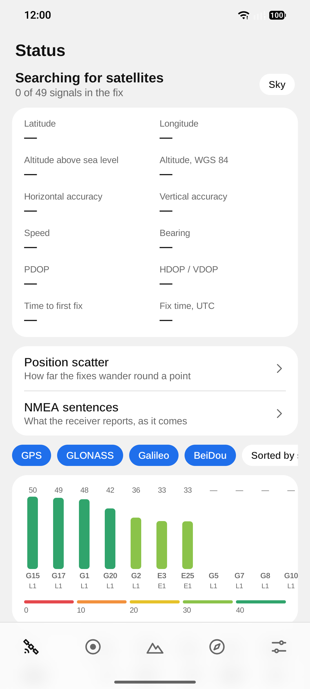
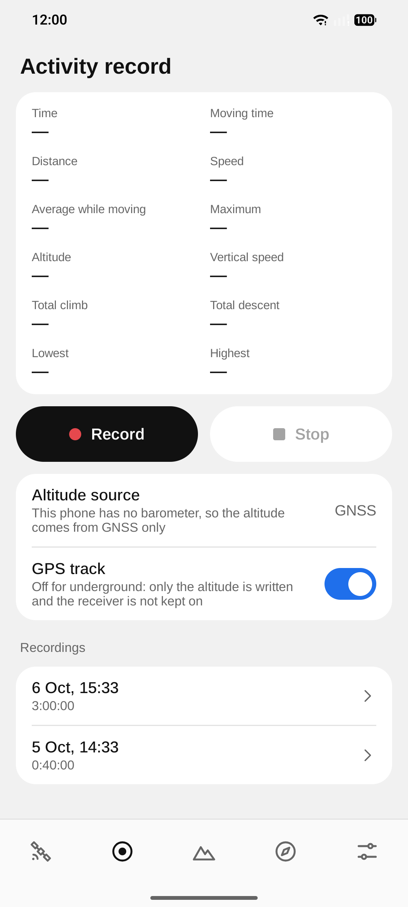
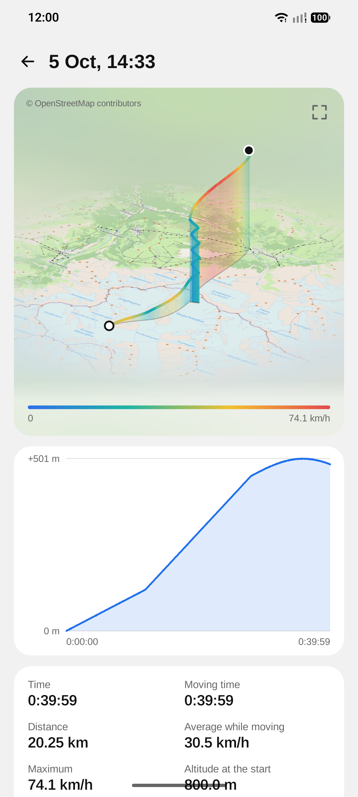
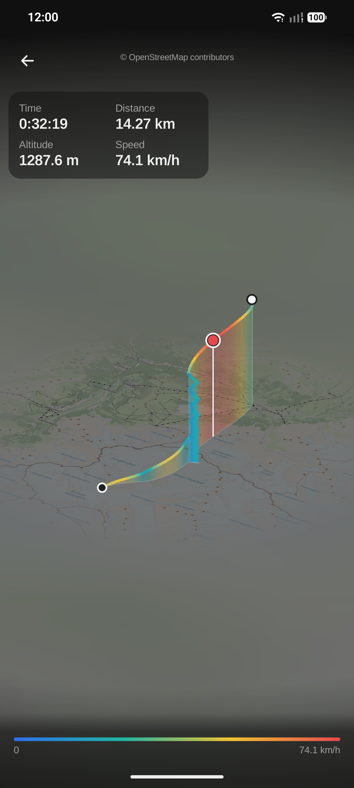
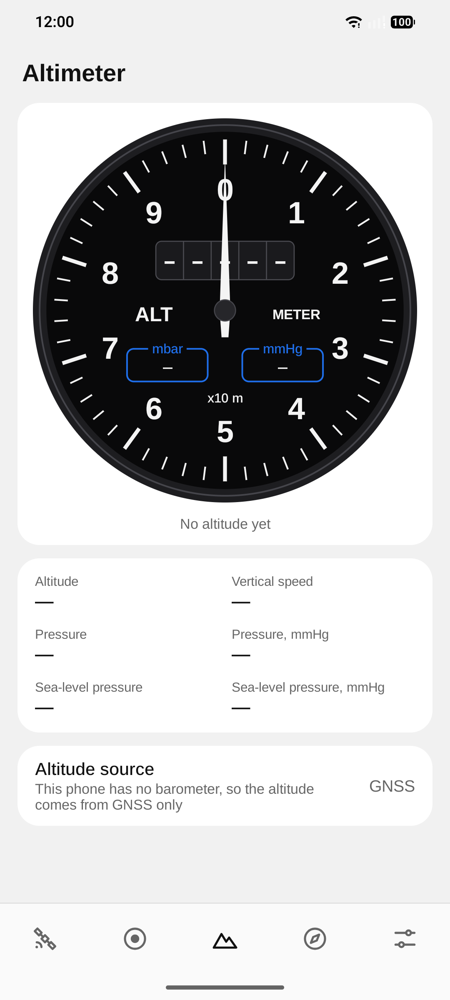
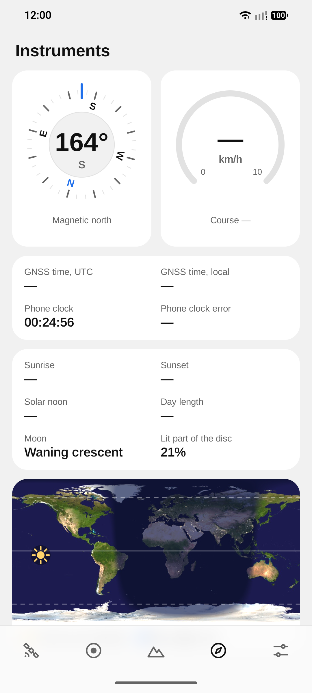

# Altair GNSS

Android app that shows what the phone's satellite receiver sees — satellites,
signal levels, the fix and its accuracy — records where you went as a track
in three dimensions, and adds a barometric altimeter that is calibrated once
and then works without any sky, for example to read depth in a cave. A modern
take on the classic GPS test apps. Android 16+ only; the interface speaks ten
languages.

<p>
  
  
  
  
  
  
</p>

The screenshots were taken indoors on a phone without a barometer, before
the receiver had a fix, so the position fields and the altimeter are empty.
The track on them is made up and lies in the Alps.

## Contents

- [Features](#features)
- [Stack](#stack)
- [Project layout](#project-layout)
- [Build](#build)
  - [Local build in Docker](#local-build-in-docker)
  - [Install on a phone](#install-on-a-phone)
- [Download](#download)
- [Design](#design)
- [License](#license)

## Features

- **Status** — the fix, its accuracy and every signal the receiver hears, a
  warning when they look jammed or faked, and a sky plot that turns with you.
- **Position scatter and NMEA** — how far the fixes wander round a point, and
  the receiver's own sentences, live and saved to a file.
- **Activity record** — records altitude, position and speed with the screen
  off, shows the figures as it runs and takes checkpoints with a note.
- **Track in three dimensions** — a finished recording as a ribbon coloured
  by speed to turn, zoom and tap, its checkpoints as flags, on a map if wanted.
- **Height chart** — height over time with round marks of time, the
  checkpoints on it, full screen on a tap; the recording exports to CSV.
- **Under ground, or under a jammed sky** — a recording can run on the
  barometer alone, or take its position from Wi-Fi and cell towers as well.
- **Altimeter** — an aircraft-style dial fed by GNSS, the barometer or both,
  calibrated under the sky, from a known altitude or an airport's report.
- **Instruments** — compass, speedometer, GNSS clock, sun and moon, and a
  world map of daylight.
- **Backup and updates** — recordings and settings in one file, encrypted
  with a password if you like; new versions straight from GitHub.
- **Private by default** — satellites only unless you say otherwise, no
  accounts or analytics, and the network serves only what you switch on.

## Stack

| Area | Choice |
|---|---|
| Language / build | Kotlin 2.4, AGP 9.4 (built-in Kotlin), Gradle 9.8, JDK 25 |
| SDK | `minSdk 36` (Android 16), `compileSdk`/`targetSdk 37` |
| UI | Jetpack Compose (BOM 2026.09), Material 3, Navigation 3 |
| Storage | Room 3 (KSP, bundled SQLite) for recordings, DataStore for settings |
| Network | `HttpsURLConnection`, kotlinx.serialization for JSON |

All versions live in [`gradle/libs.versions.toml`](gradle/libs.versions.toml).

## Project layout

```
app/src/main/kotlin/dev/glowcow/altairgnss/
  gnss/         signal model, carrier bands, NMEA and coordinate formats;
                GnssMonitor turns the platform callbacks into one state
  altimeter/    barometric formula, calibration, drift and blending;
                PressureMonitor (the sensor) and Altimeter (the sources)
  instruments/  sunrise equation, the sun's place over the Earth, moon phase,
                compass points, trip statistics;
                CompassMonitor (the rotation sensor)
  recording/    recordings of a track: the Room database, the recorder, the
                foreground service that keeps it going, the figures of a
                track, its layout for the 3D view, stops and CSV
  backup/       the backup archive, its password encryption, save and restore
  maps/         map tiles: their arithmetic, the cache on the phone, the two
                layers of ground put together for a track
  airports/     airport weather reports: parsing, distances, the request
  update/       check for a new release, download, the weekly job
  data/         settings and what the altimeter remembers
  ui/recording/ the Activity record tab, a recording's page, the track in
                three dimensions and the height chart
  ui/tools/     position scatter and the NMEA page, opened from Status
  ui/           theme + icons, shared components (tab page with the frosted
                bars, grouped rows and sheets, stats, the signal colour
                scale, the screen heading, the location permission gate),
                navigation root, one package per screen
app/schemas/    the database schema of each version, for migrations
app/src/test/   unit tests of the plain JVM code in gnss, altimeter,
                instruments, recording, backup, maps, airports and update
docs/           screenshots
```

## Build

The host needs only Docker: JDK, Android SDK and the Gradle distribution live
in the `glowcow/android-sdk` image on Docker Hub (tag =
`<build-tools>-gradle<gradle>`), so a build downloads only the app's own
dependencies. Keep the tag in step with `buildToolsVersion` and the Gradle
wrapper.
The build runs as `linux/amd64` (Google ships `aapt2` for x86-64 Linux only).
On Apple Silicon turn on *Use Rosetta for x86_64/amd64 emulation* in Docker
Desktop and give the VM ~12 GB of memory.

### Local build in Docker

Run Gradle in the toolchain image with the sources mounted and a persistent
dependency cache:

```sh
IMAGE=glowcow/android-sdk:37.0.0-gradle9.8.0
RUN="docker run --rm --platform linux/amd64 -v $PWD:/src -w /src -v altair-gnss-gradle:/root/.gradle/caches -v altair-gnss-keys:/root/.android $IMAGE"

# debug APKs + unit tests
$RUN ./gradlew testDebugUnitTest assembleDebug

# lint + release APKs, unsigned; -PappVersion sets the version
$RUN ./gradlew -PappVersion=0.1.0 lintRelease assembleRelease
```

The APKs land in `app/build/outputs/apk/<type>/`, one per ABI:
`app-arm64-v8a-<type>.apk` for phones and `app-x86_64-<type>.apk` for the
emulator. The `altair-gnss-keys` volume keeps the debug keystore, so a rebuilt
debug APK installs over the previous one.

### Install on a phone

Enable *Developer options → Wireless debugging* on the phone, then use `adb`
from the same image (the volume keeps the adb pairing keys):

```sh
docker run --rm -it --platform linux/amd64 -v altair-gnss-adb:/root/.android -v "$PWD/app/build/outputs/apk":/apk \
  glowcow/android-sdk:37.0.0-gradle9.8.0 sh -c 'adb pair <ip>:<pair-port> && adb connect <ip>:<port> && adb install -r /apk/debug/app-arm64-v8a-debug.apk'
```

Or copy the APK to the phone and open it.

## Download

Signed APKs are attached to every
[release](https://github.com/glowcow/altair-gnss/releases). Phones take
`altair-gnss-<version>-arm64-v8a-release.apk`; the `x86_64` one is for the
emulator. There is no store listing: allow your browser or file manager to
install apps, then open the file. Later versions can be installed from inside
the app: *Settings → Version*.

Releases are signed with the certificate `CN=Anton Sediuk, O=glowcow`,
SHA-256
`7E:63:EC:86:6B:13:A8:23:B4:1B:4F:07:05:75:50:13:8F:B6:65:C3:50:B8:0D:41:CF:CF:B2:19:CB:98:C5:67`.
Check a downloaded file with `apksigner verify --print-certs <file>.apk`.

## Design

The look is shared with [stackd](https://github.com/glowcow/stackd). The
default *classic* scheme is neutral grey — light `#FAFAFA` / dark `#161616`
backgrounds, accent `#1F6FEB`; the *warm* scheme has `#FAF9F5` / `#1A1A18`
and accent `#D97757`. UI font: Arimo. The launcher icon and the splash
screen use the brand palette: navy `#0B1630`, gold `#FFD36B`, ice `#9FB7D9`.

## License

[GNU General Public License v3.0 or later](LICENSE) © Anton Sediuk. A
modified version you distribute has to stay open under the same licence.

Arimo is bundled under the SIL Open Font License 1.1 — see
[`licenses/Arimo-OFL.txt`](licenses/Arimo-OFL.txt).

The world map uses NASA's Blue Marble and Black Marble images (NASA Earth
Observatory), which are in the public domain. Airport reports come from
the Aviation Weather Center's public data API.
